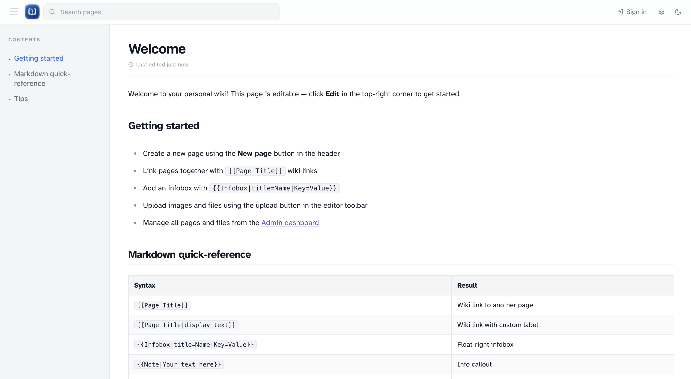
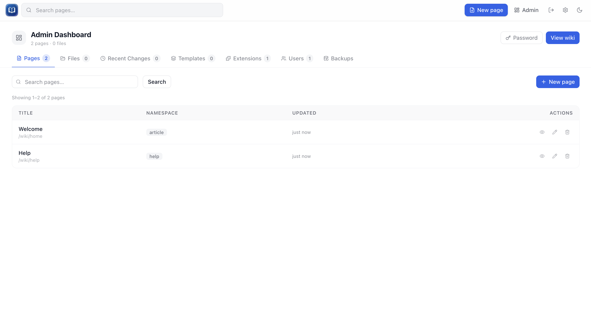

<p align="center">
  
</p>

# Simple-Wiki

A personal markdown wiki with Wikipedia-like features — wiki links, full-text search, uploads, revision history, templates, admin tools, and a pluggable extension system. Built with SvelteKit and SQLite.

<p align="center">
  
  
</p>

## Features

- **Markdown pages** with wiki links (`[[Page Title]]`), syntax highlighting, and a table of contents on long articles
- **Search** with live suggestions in the header
- **Editing** with a split markdown/preview editor (live client-side preview — no server round-trip while typing), infoboxes, image boxes, and callout templates
- **Revision history** with diffs and restore
- **Uploads** for images and files
- **Admin dashboard** — pages, users, uploads, templates, recent changes, backups, and extensions
- **Family tree extension** — interactive trees embeddable in any page
- **Reading settings** — font (site-wide), text size, and column width (gear icon in the header)

## Getting started

```bash
bun install
bun run dev
```

Open **http://localhost:5173** (or the port shown in the terminal).

On first run the app creates a SQLite database and an admin account (`admin`). Check the server logs for a one-time password, or set `ADMIN_PASSWORD` (at least 8 characters) in `.env` **before** the first start. You'll be required to change the password on first login. Existing databases are not affected — this only applies when the admin user is first created.

Copy `.env.example` to `.env` to customize paths, port, or behavior. Everything works out of the box without it.

### Production build

```bash
bun run build
bun run start
```

`bun run start` serves the built app on **http://localhost:3000** by default (`PORT` in `.env`).

### Scripts

| Command         | Description                        |
| --------------- | ---------------------------------- |
| `bun run dev`   | Development server with hot reload |
| `bun run build` | Production build                   |
| `bun run start` | Run the production server          |
| `bun run check` | Typecheck (Svelte + TypeScript)    |
| `bun run test`  | Run tests (uses Node/vitest — prefer this over bare `bun test`) |

## Docker

```bash
docker compose up --build
```

Open **http://localhost:3000**. The database and uploads live in Docker volumes so they survive restarts.

Production images use Node (`node build/index.js`). Bun is fine for local development.

Pre-built images are published to GitHub Container Registry on pushes to `main`:

```bash
docker pull ghcr.io/tpbnick/simple-wiki:latest
```

### Unraid / NAS

Optionally set **`PUID`** and **`PGID`** together so files in appdata match host ownership. On Unraid, `99` / `100` (`nobody:users`) is typical:

| Variable | Unraid example | Description              |
| -------- | -------------- | ------------------------ |
| `PUID`   | `99`           | User ID the app runs as  |
| `PGID`   | `100`          | Group ID the app runs as |

Both must be set when overriding IDs. If omitted, the container uses its built-in `wiki` user.

On startup the entrypoint fixes ownership of `/data` and `/uploads`, then runs the app as that user. Map volumes in the Unraid Docker UI:

| Host path                               | Container path |
| --------------------------------------- | -------------- |
| `/mnt/user/appdata/simple-wiki/data`    | `/data`        |
| `/mnt/user/appdata/simple-wiki/uploads` | `/uploads`     |

Required env vars: `DATABASE_PATH=/data/wiki.db`, `UPLOADS_DIR=/uploads`.

For plain HTTP on LAN, set `COOKIE_SECURE=false` (see `docker-compose.ghcr.yml`). Use HTTPS and `COOKIE_SECURE=true` if the wiki is reachable from untrusted networks.

See `docker-compose.ghcr.yml` for a full compose example. Set `PUID=0` and `PGID=0` only if you intentionally want the process to run as root.

### Backups

Admin → Backups can export/import a zip containing `wiki.db`, optional markdown exports, and optional uploads.

- **Database import** replaces the live wiki database (with rollback on failure).
- **Restore uploads** merges files from the backup: matching filenames are overwritten; uploads on disk that are **not** in the backup are kept (not deleted).

Import shows a 503 to other users while the database swap is in progress.

## Environment variables

Copy `.env.example` to `.env` and uncomment or set values as needed.

### Paths & server

| Variable          | Default                                                     | Description                                                                         |
| ----------------- | ----------------------------------------------------------- | ----------------------------------------------------------------------------------- |
| `DATABASE_PATH`   | `./wiki.db`                                                 | SQLite database file                                                                |
| `UPLOADS_DIR`     | `./uploads` (or `/uploads` in Docker when that path exists) | Directory for uploaded files; must match the container volume mount                 |
| `PORT`            | `3000`                                                      | Port for `bun run start` / production server                                        |
| `BODY_SIZE_LIMIT` | `512K` (adapter-node) / `512M` (Docker image)               | Max POST body size for backup restore and file uploads; override for larger imports |

### Wiki identity

| Variable    | Default | Description                                    |
| ----------- | ------- | ---------------------------------------------- |
| `WIKI_NAME` | `Wiki`  | Display name shown in the admin UI and backups |

### Access control

| Variable          | Default | Description                                                                 |
| ----------------- | ------- | --------------------------------------------------------------------------- |
| `PUBLIC_READ`     | enabled | Set to `false` to require login for reading pages and read APIs             |
| `ADMIN_PASSWORD`  | —       | Initial `admin` password on **first boot only** (min 8 chars; random + logged if unset) |

Page content is limited to **2 MB** per save (editor form and API).

### Sessions & cookies

| Variable        | Default              | Description                                                                |
| --------------- | -------------------- | -------------------------------------------------------------------------- |
| `NODE_ENV`      | —                    | Set to `production` for production deployments                             |
| `COOKIE_SECURE` | `true` in production | Set to `false` for plain HTTP (e.g. local Docker). Use `true` behind HTTPS |

### Reverse proxy

When the wiki runs behind a proxy (Caddy, nginx, Traefik), set these so rate limits use the real client IP:

| Variable         | Example           | Description                     |
| ---------------- | ----------------- | ------------------------------- |
| `ADDRESS_HEADER` | `x-forwarded-for` | Header containing the client IP |
| `XFF_DEPTH`      | `1`               | How many proxy hops to trust    |

### Localization

| Variable             | Default | Description                                         |
| -------------------- | ------- | --------------------------------------------------- |
| `PUBLIC_WIKI_LOCALE` | `en-US` | BCP 47 locale for formatted dates (client + server) |

## Extensions

Extensions add features to Simple-Wiki without modifying core app code. Each extension lives in `extensions/<name>/` and is **compiled into the app at build time**.

> Extensions run trusted code at startup. Only install extensions you wrote or fully trust.

### How loading works

1. On build, SvelteKit bundles every `extensions/*/index.ts` file into the server.
2. On startup, the app loads each extension, applies any database schema, and registers hooks.
3. Optional client code (`mount-client.ts`) and styles (`styles/*.css`) are bundled for the browser.

After changing an extension, run `bun run build` and restart the server.

The bundled **Example** extension (`extensions/example/`) is included in development only. **Family Tree** (`extensions/family-tree/`) ships in production.

### Extension structure

```
extensions/my-extension/
  index.ts           # Required — extension entry point
  schema.sql         # Optional — tables created on first DB open
  mount-client.ts    # Optional — client-side interactivity for page embeds
  styles/            # Optional — CSS loaded globally
  routes/            # Optional — SvelteKit routes (see family-tree for a full example)
```

### Extension API

Each extension exports a default object matching `WikiExtension`:

```typescript
const extension: WikiExtension = {
  name: 'My Extension',
  version: '1.0.0',
  description: 'What it does',
  manageHref: '/my-extension',       // optional — link from Admin → Extensions
  schema: 'CREATE TABLE IF NOT EXISTS ...',  // optional
  writeGuardPaths: ['/api/my-ext'],  // optional — require login for writes
  hooks: {
    onSidebarItems(items) { ... },           // add nav links
    onTemplateParse(name, params) { ... },   // custom {{Template}} syntax
    onEditorToolbarItems() { ... },         // editor toolbar buttons
    onEditorLoad(toolIds) { ... },            // data for the editor
    onPageRender(html, page) { ... },        // transform rendered HTML
    onDatabaseReset() { ... }                 // clear caches after backup restore
  }
}
```

### Examples

- **`extensions/example/`** — minimal starter: sidebar link + `{{Counter}}` template
- **`extensions/family-tree/`** — full extension with database schema, API routes, editor toolbar, `{{FamilyTree}}` embeds, and client-side canvas rendering

View loaded extensions in **Admin → Extensions**.

## License

MIT
