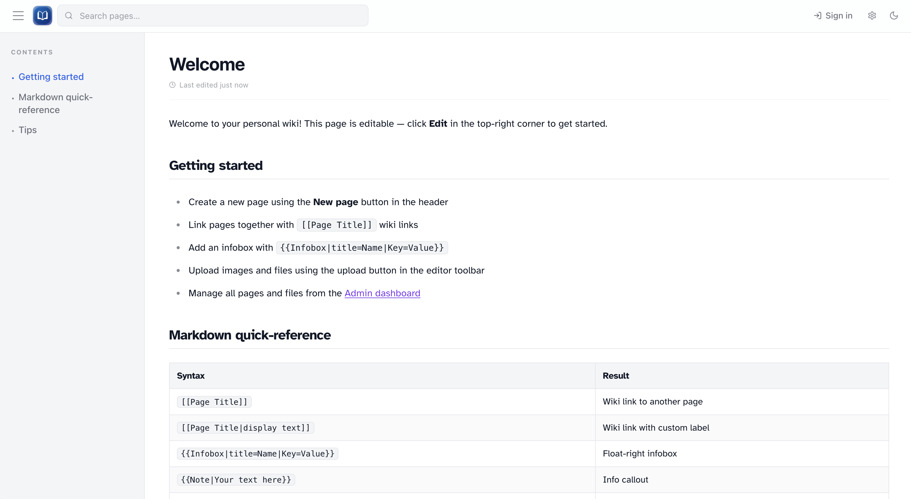
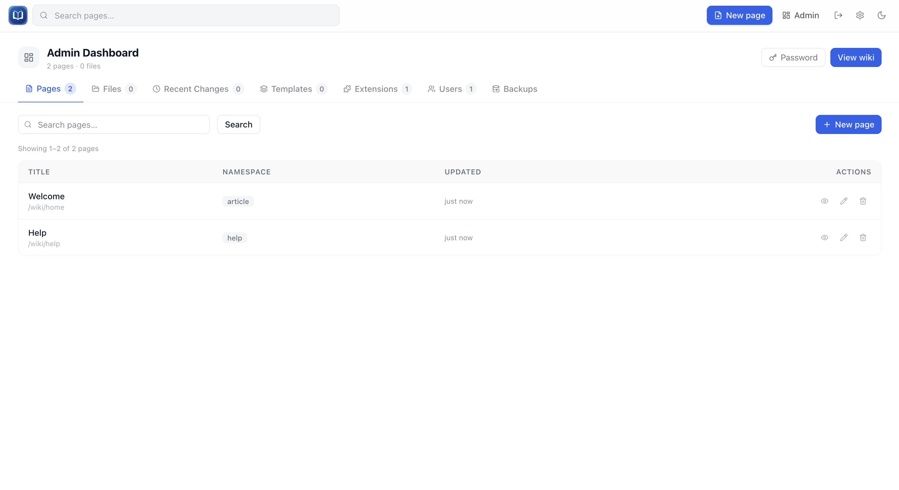

<p align="center">
  
</p>

# Simple-Wiki

[](https://github.com/tpbnick/simple-wiki/actions/workflows/ci.yml)

A personal markdown wiki with Wikipedia-like features — wiki links, full-text search, uploads, revision history, templates, admin tools, and a pluggable extension system. Built with SvelteKit and SQLite.

**[User guide](https://tpbnick.github.io/simple-wiki/)** — how to read, edit, and manage your wiki (hosted on GitHub Pages).

<p align="center">
  
  
</p>

> [!IMPORTANT]  
> This application was developed with the assistance of AI.

## Features

- **Markdown pages** with wiki links (`[[Page Title]]`), syntax highlighting, and a table of contents on long articles
- **Search** with live suggestions in the header
- **Editing** with a split markdown/preview editor (live client-side preview — no server round-trip while typing), infoboxes, image boxes, and callout templates
- **Revision history** with diffs and restore
- **Uploads** for images and files
- **Admin dashboard** — pages, users, uploads, templates, recent changes, backups, and extensions
- **Family tree extension** — interactive trees embeddable in any page
- **Reading settings** — font (site-wide), text size, and column width (gear icon in the header)

## Getting started

```bash
bun install
bun run dev
```

Open **http://localhost:5173** (or the port shown in the terminal).

On first run the app creates a SQLite database and an admin account (`admin`). Check the server logs for a one-time password, or set `ADMIN_PASSWORD` (at least 8 characters) in `.env` **before** the first start. You'll be required to change the password on first login. Existing databases are not affected — this only applies when the admin user is first created.

Copy `.env.example` to `.env` to customize paths, port, or behavior. Everything works out of the box without it.

### Production build

```bash
bun run build
bun run start
```

`bun run start` serves the built app on **http://localhost:3000** by default (`PORT` in `.env`).

Development scripts, the user-guide preview, and the extension API are in [CONTRIBUTING.md](CONTRIBUTING.md). Family Tree ships with the app; turn extensions on or off in **Admin → Extensions**.

## Self-hosting on your LAN

Defaults are tuned for **home / NAS use** (Unraid, Docker on a private network):

- **Public read** is on — anyone on your network can read pages without logging in. Set `PUBLIC_READ=false` if you want login required for reading.
- **Plain HTTP** is supported — `COOKIE_SECURE=false` in the bundled compose files is intentional for `http://host:3000` on a trusted LAN.
- **Every wiki account can edit** — there are no read-only editor roles; only create accounts for people you trust with the whole site.

If the wiki is reachable from the **public internet**, use HTTPS, `COOKIE_SECURE=true`, `WIKI_ORIGIN`, and consider `PUBLIC_READ=false`. See [Access control](#access-control) and [Reverse proxy](#reverse-proxy).

## Docker

```bash
docker compose up --build
```

Open **http://localhost:3000**. The database and uploads live in Docker volumes so they survive restarts.

Production images use Node via `server/start.mjs` (`bun run start` / Docker `CMD`). That wrapper sets CSRF-safe defaults for plain HTTP and aliases `WIKI_ORIGIN` → `ORIGIN`. Bun is fine for local development.

Pre-built images are published to GitHub Container Registry on pushes to `main`:

```bash
docker pull ghcr.io/tpbnick/simple-wiki:latest
```

### Unraid / NAS

Optionally set **`PUID`** and **`PGID`** together so files in appdata match host ownership. On Unraid, `99` / `100` (`nobody:users`) is typical:

| Variable | Unraid example | Description              |
| -------- | -------------- | ------------------------ |
| `PUID`   | `99`           | User ID the app runs as  |
| `PGID`   | `100`          | Group ID the app runs as |

Both must be set when overriding IDs. If omitted, the container uses its built-in `wiki` user.

On startup the entrypoint fixes ownership of `/data` and `/uploads`, then runs the app as that user. Map volumes in the Unraid Docker UI:

| Host path                               | Container path |
| --------------------------------------- | -------------- |
| `/mnt/user/appdata/simple-wiki/data`    | `/data`        |
| `/mnt/user/appdata/simple-wiki/uploads` | `/uploads`     |

Required env vars: `DATABASE_PATH=/data/wiki.db`, `UPLOADS_DIR=/uploads`.

`docker-compose.yml` and `docker-compose.ghcr.yml` already set `COOKIE_SECURE=false` for LAN HTTP. Behind HTTPS (NPM, SWAG, Caddy), set `COOKIE_SECURE=true` and `WIKI_ORIGIN` to your public URL.

See `docker-compose.ghcr.yml` for a full compose example. **Do not** set `PUID=0` / `PGID=0` unless you intentionally want the process to run as root.

### Backups

Admin → Backups can export/import a zip containing `wiki.db`, optional markdown exports, and optional uploads.

- **Database import** replaces the live wiki database only when you check **Fully overwrite existing database** in Admin → Backups (with rollback on failure).
- **Restore uploads** merges files from the backup: matching filenames are overwritten; uploads on disk that are **not** in the backup are kept (not deleted).

Import shows a 503 to other users while the database swap is in progress.

### Reset a password

```bash
docker exec <container> node scripts/reset-password.mjs admin
```

Omit the password to get a random temporary one printed to the terminal. List users with `--list`. Works locally too: `bun run reset-password -- admin`.

## Environment variables

Copy `.env.example` to `.env` and uncomment or set values as needed.

### Paths & server

| Variable          | Default                                                           | Description                                                                         |
| ----------------- | ----------------------------------------------------------------- | ----------------------------------------------------------------------------------- |
| `DATABASE_PATH`   | `./wiki.db`                                                       | SQLite database file                                                                |
| `UPLOADS_DIR`     | `./uploads` (or `/uploads` in Docker when that path exists)       | Directory for uploaded files; must match the container volume mount                 |
| `PORT`            | `3000`                                                            | Port for `bun run start` / production server                                        |
| `BODY_SIZE_LIMIT` | `512M` via `bun run start` / Docker; adapter-node alone is `512K` | Max POST body size for backup restore and file uploads; override for larger imports |

### Wiki identity

| Variable    | Default | Description                                    |
| ----------- | ------- | ---------------------------------------------- |
| `WIKI_NAME` | `Wiki`  | Display name shown in the admin UI and backups |

### Access control

| Variable         | Default | Description                                                                               |
| ---------------- | ------- | ----------------------------------------------------------------------------------------- |
| `PUBLIC_READ`    | enabled | Fine for LAN wikis. Set to `false` for a private site or when exposed beyond home network |
| `ADMIN_PASSWORD` | —       | Initial `admin` password on **first boot only** (min 8 chars; random + logged if unset)   |

All logged-in users can edit pages, upload files, and use extensions — not only admins. Admins additionally manage users, backups, and settings.

Page content is limited to **2 MB** per save (editor form and API), which does NOT include images/uploads - the 2MB is raw markdown text.

### Sessions & cookies

| Variable        | Default              | Description                                                                |
| --------------- | -------------------- | -------------------------------------------------------------------------- |
| `NODE_ENV`      | —                    | Set to `production` for production deployments                             |
| `COOKIE_SECURE` | `true` in production | Set to `false` for plain HTTP (e.g. local Docker). Use `true` behind HTTPS |

### Reverse proxy

When the wiki runs behind a proxy (Caddy, nginx, Traefik), set these so rate limits use the real client IP:

| Variable         | Example           | Description                     |
| ---------------- | ----------------- | ------------------------------- |
| `ADDRESS_HEADER` | `x-forwarded-for` | Header containing the client IP |
| `XFF_DEPTH`      | `1`               | How many proxy hops to trust    |

### Localization

| Variable             | Default | Description                                         |
| -------------------- | ------- | --------------------------------------------------- |
| `PUBLIC_WIKI_LOCALE` | `en-US` | BCP 47 locale for formatted dates (client + server) |

## License

MIT
