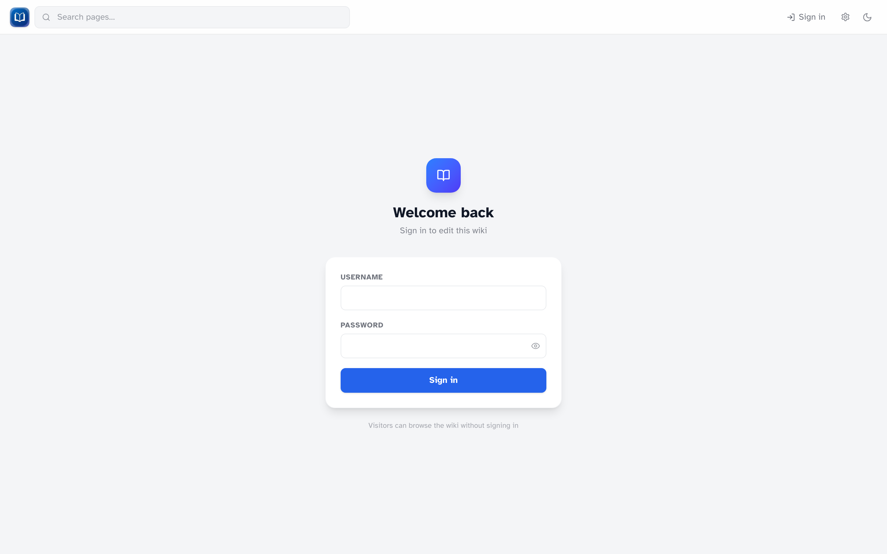

# Accounts & access

_Visitors can browse without signing in when public read is enabled. Editors sign in via this form._

## Public read vs private wiki

On most home-network setups, **public read** is on — anyone can browse and search without an account. That's the default.

If your wiki is on the public internet, the person who hosts it may turn public read off (`PUBLIC_READ=false`). Then every page requires a login.

## Roles

| Role        | What you can do                                                                                |
| ----------- | ---------------------------------------------------------------------------------------------- |
| **Visitor** | Read and search (when public read is on), change reading settings                              |
| **Editor**  | Everything above, plus create and edit pages, upload files, restore revisions, use extensions  |
| **Admin**   | Everything above, plus the admin dashboard: users, backups, extension toggles, revision limits |

!!! important "Every account can edit everything"
There is no read-only editor role. If someone has an account, they can edit any page. Only give accounts to people you trust with the whole wiki.

## Signing in

1. Click **Sign in** in the header (or go to `/login`)
2. Enter your username and password
3. Use the eye icon to show or hide your password while typing

After a successful login, you return to the page you were on. If you clicked something that required login first, the URL may include `?next=/some/path` to send you back there.

## Password rules

- At least **8 characters**
- Every new account must **change its password** on first login
- After that, any signed-in user can change their password at `/admin/change-password`
- Admins also have a **Password** link in the admin dashboard header

On first login, set your new password before doing anything else on the wiki.

## Signing out

Click **Sign out** in the header.

## Who needs an account?

| Task                             | Account required? |
| -------------------------------- | ----------------- |
| Read pages (public wiki)         | No                |
| Search                           | No                |
| Create or edit pages             | Yes               |
| Upload files                     | Yes               |
| View history / restore revisions | Yes               |
| Admin dashboard                  | Yes (admin role)  |

## Too many login attempts

After several failed sign-in attempts, you'll be asked to wait before trying again (about 15 minutes). This is normal — wait it out, or double-check your username and password.
