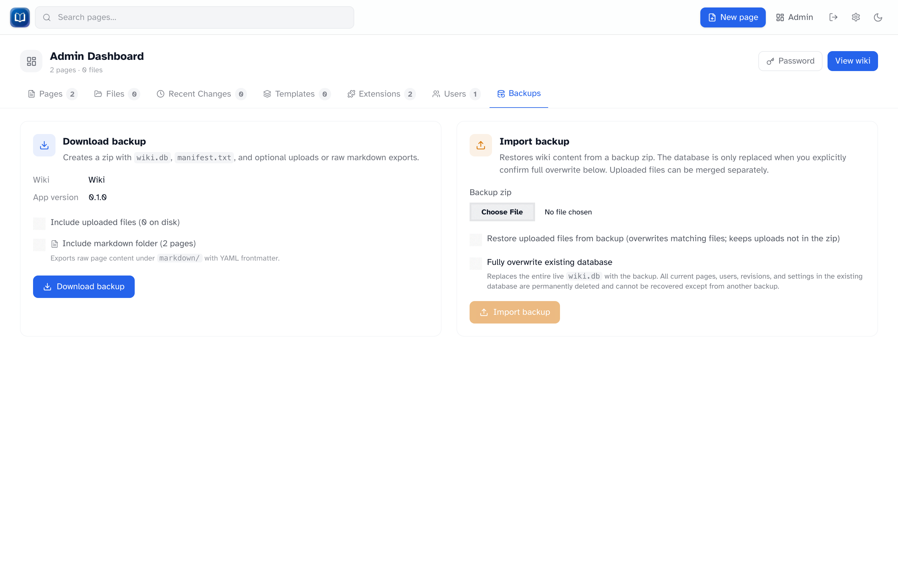

# Backups

_Export and import wiki backups as zip files._

**Admin → Backups** lets you download a snapshot of the wiki or restore from one.

## Export

Click **Export backup** for a zip containing:

- `wiki.db` — always included
- `manifest.txt` — wiki name and export date
- **Uploaded files** — optional (the UI warns when that library is large; export loads uploads into memory)
- **`markdown/` folder** — raw page exports with YAML frontmatter — optional

Keep backups somewhere safe, not just on the same machine as the wiki.

## Import

Import replaces your live data. Read the checkboxes carefully.

1. Upload a backup zip
2. Check **Fully overwrite existing database** (required)
3. Optionally check **Restore uploads** to merge files from the backup
4. Click **Import**

While the database swaps, other users see a **503** page. It usually takes a few seconds.

If something goes wrong, the import rolls back automatically.

### Upload merge

| Situation                       | What happens           |
| ------------------------------- | ---------------------- |
| File in backup, already on disk | Overwritten            |
| File in backup, not on disk     | Added                  |
| File on disk, not in backup     | **Kept** — not deleted |

## When to back up

- Before importing a backup
- Before bulk edits or upgrades
- Regularly, if people edit the wiki often

## Tips

- Include uploads if your wiki has lots of images
- The markdown export is handy for reading content outside the wiki
- Test a restore on a copy before relying on a backup in production
