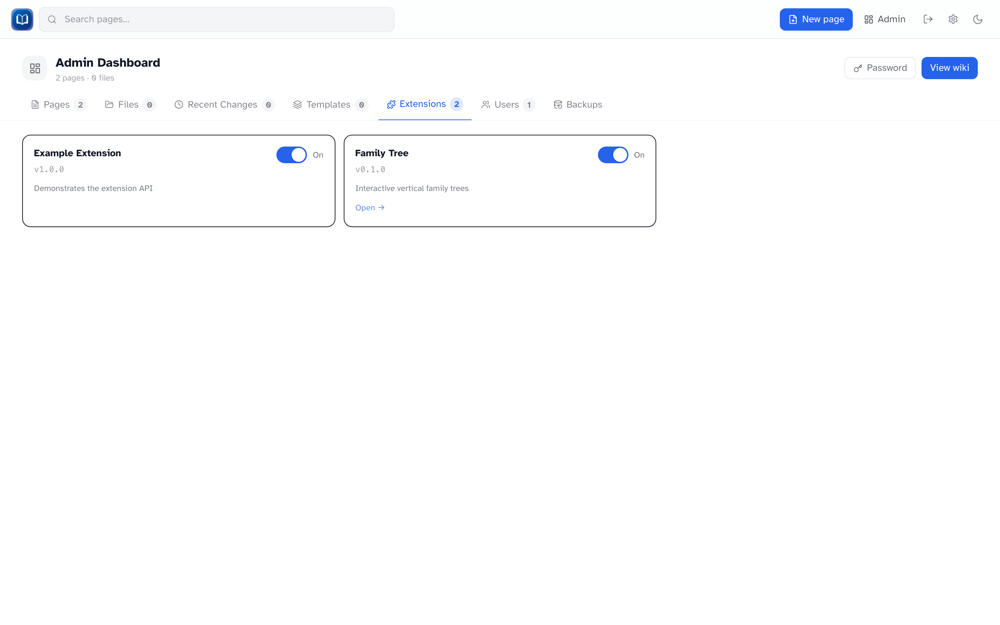

# Extensions

*Enable or disable bundled extensions.*

Extensions add features beyond the core wiki. They're built into the app — you enable or disable them here, not install new ones from the UI.

## Admin → Extensions

| Column | Meaning |
|--------|---------|
| **Name** / **Version** / **Description** | What the extension is |
| **Enabled** | On/off toggle — takes effect immediately |
| **Manage** | Link to the extension's page (if it has one) |

When an extension is off:

- Its pages return 404
- Embeds like `{{FamilyTree}}` don't render
- Toolbar buttons and sidebar links disappear

## Family Tree

The main extension in production builds:

- `/family-tree` — manage trees
- `{{FamilyTree|family=slug}}` — embed in articles
- Toolbar integration in the page editor

See [Family trees](../family-trees.md).

## Adding new extensions

New extensions are added by a developer editing the source code — see the [project README](https://github.com/tpbnick/simple-wiki#extensions).

!!! warning "Trust matters"
    Extensions run code at server startup. Only use extensions you wrote or fully trust.
