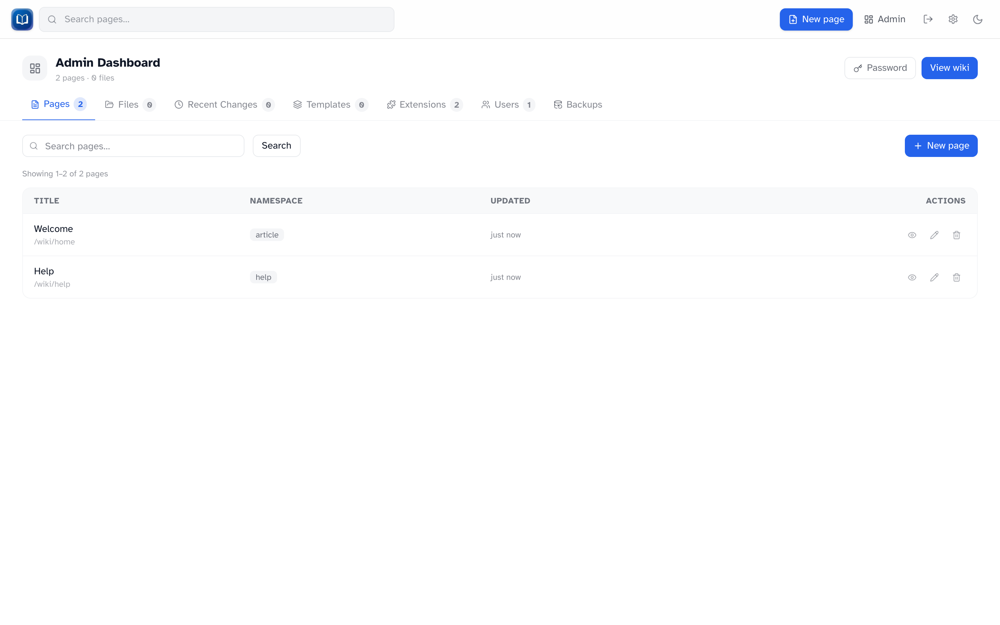

# Admin dashboard

_The admin dashboard with page search, listing, and actions._

The admin dashboard at `/admin` is for users with the admin role. Click **Admin** in the header after signing in.

## Tabs

| Tab                | What you do there                                 |
| ------------------ | ------------------------------------------------- |
| **Pages**          | Search, view, edit, delete, and create pages      |
| **Files**          | Browse, preview, rename, and delete uploads       |
| **Recent Changes** | Site-wide edit feed + revision retention settings |
| **Templates**      | Manage template-namespace pages                   |
| **Extensions**     | Enable or disable bundled extensions              |
| **Users**          | Create, promote/demote, and delete accounts       |
| **Backups**        | Export and import the wiki                        |

## Pages

Search and paginate through all pages (100 per page).

| Action              | Notes            |
| ------------------- | ---------------- |
| **View** / **Edit** | Open the page    |
| **Delete**          | Removes the page |
| **New page**        | Opens the editor |

## Files

See [Uploads](../editing/uploads.md) for rename and delete behavior.

## Recent Changes

Same feed as `/recent`, plus revision retention controls inline.

## Templates

Lists template-namespace pages. **New page** opens the editor with namespace set to `template`.

## Change password

The **Password** link in the admin header goes to `/admin/change-password`. Any signed-in user can use that URL, not just admins.

## Wiki name

The name shown in the admin UI and backups comes from the `WIKI_NAME` environment variable, set by whoever hosts the wiki.
