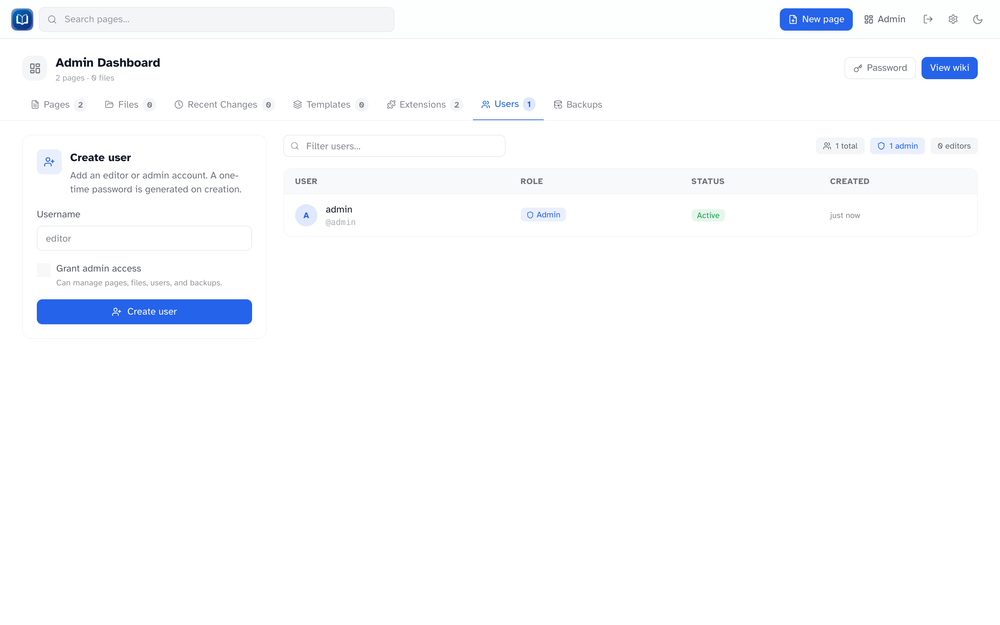

# User management

<div class="screenshot" markdown>


_Create accounts and manage roles from Admin → Users._

</div>

Admins manage accounts under **Admin → Users**.

## Creating a user

1. Go to **Admin → Users**
2. Enter a **username** (letters, numbers, underscores, hyphens)
3. Check **Admin** if they need dashboard access
4. Click **Create user**

A **one-time password** appears on screen. Copy it with the button — it won't be shown again. Send it to the new user securely.

They must change that password on first login.

## User list

| Column                   | Meaning                                |
| ------------------------ | -------------------------------------- |
| **Username**             | Login name                             |
| **Role**                 | Admin or Editor                        |
| **Must change password** | Waiting on first-login password change |
| **Created**              | When the account was made              |
| **Actions**              | Promote / demote, or delete            |

## Roles

- **Editor** — can edit pages, upload files, use extensions
- **Admin** — all of the above, plus the admin dashboard

Use **Promote** / **Demote** in the actions column to change a role. You can’t demote or delete the last admin, and you can’t delete your own account.

## Deleting a user

Click the delete button next to the user and confirm. Their sessions end immediately.

## If someone loses their password

Ask whoever hosts the wiki to reset it from the shell:

```bash
docker exec <container> node scripts/reset-password.mjs <username>
```

That prints a new temporary password. List accounts with `--list`. Locally: `bun run reset-password -- <username>`.

## Tips

- Only make someone an admin if they need to manage users, backups, or extensions
- Usernames can't be changed after creation
