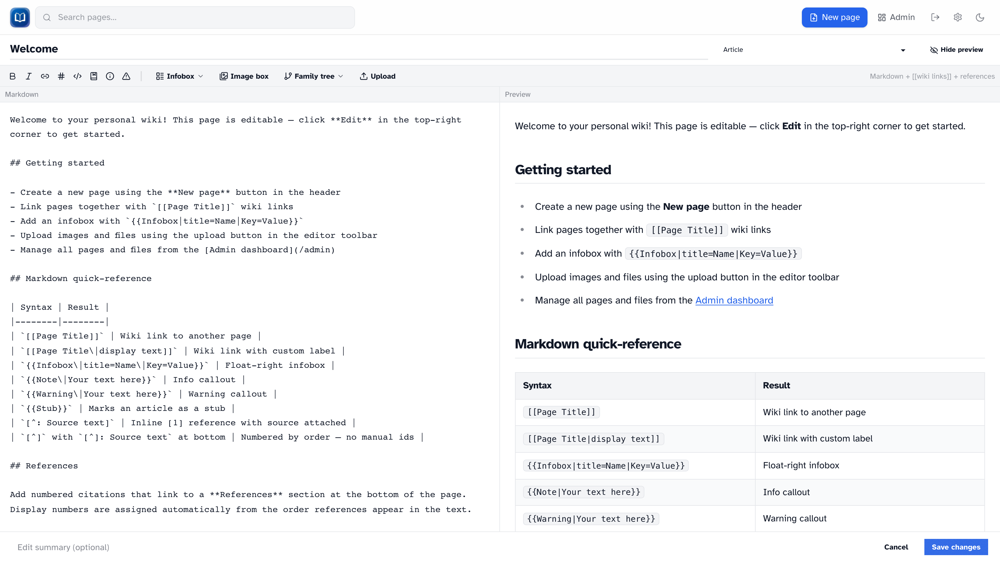

# Editing basics

_The editor with markdown source, live preview, toolbar, and infobox panel._

## Ways to create a page

| How                 | Where                                                          |
| ------------------- | -------------------------------------------------------------- |
| **New page** button | Header (signed in)                                             |
| Red wiki link       | Click a `[[Page Title]]` link to a page that doesn't exist yet |
| Search              | **Create "[query]"** when search finds nothing (signed in)     |
| Admin               | **Admin → Pages → New page**                                   |

## The editor

You'll see a split view:

- **Left** — markdown source
- **Right** — live preview (updates as you type, no server round-trip)

Toggle preview with the button in the toolbar. On desktop, preview starts open. Your preference is remembered in the browser.

### Fields

| Field            | Purpose                                                        |
| ---------------- | -------------------------------------------------------------- |
| **Title**        | The name shown at the top of the page                          |
| **Namespace**    | `article` (normal), `template`, or `help`                      |
| **Edit summary** | Short note about what you changed (optional, shows in history) |
| **Content**      | The markdown body                                              |

New pages get an address like `/wiki/my-page` based on the title you enter.

### Toolbar

Quick inserts for formatting, wiki links, references, callouts, infoboxes, image boxes, uploads, and family trees (when the extension is enabled).

### Tab key

Press ++Tab++ in the markdown pane to indent. ++Shift+Tab++ outdents.

### Saving and canceling

**Save** publishes your changes and adds a revision to history.

**Cancel** returns to the article without saving.

If you've typed anything, the editor warns you before navigating away or closing the tab.

### Edit conflicts

If someone else saved while you were editing, you may see a conflict error. Reload, check what changed, and apply your edits again.

## Editing an existing page

Open the article and click **Edit** (signed in). The editor loads the current title and content.

## Namespaces

| Namespace  | Use                                                     |
| ---------- | ------------------------------------------------------- |
| `article`  | Normal wiki pages — searchable, listed on `/pages`      |
| `template` | Reusable `{{TemplateName}}` blocks                      |
| `help`     | Help content (the built-in `/wiki/help` page uses this) |

Most pages should be `article`.

## Next steps

- [Markdown & wiki links](markdown.md)
- [Templates](templates.md)
- [Uploads](uploads.md)
- [References](references.md)
