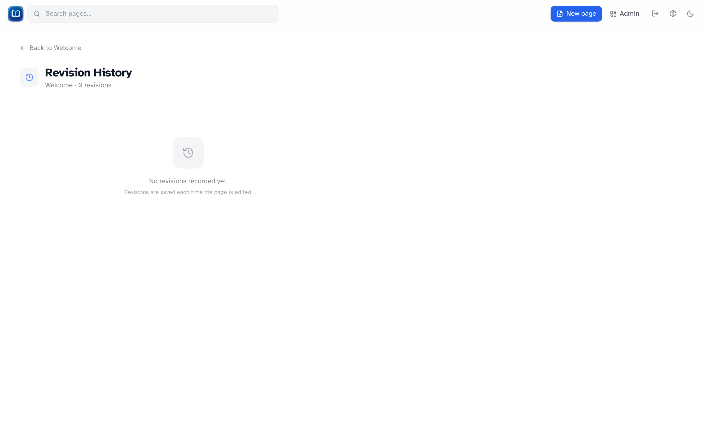
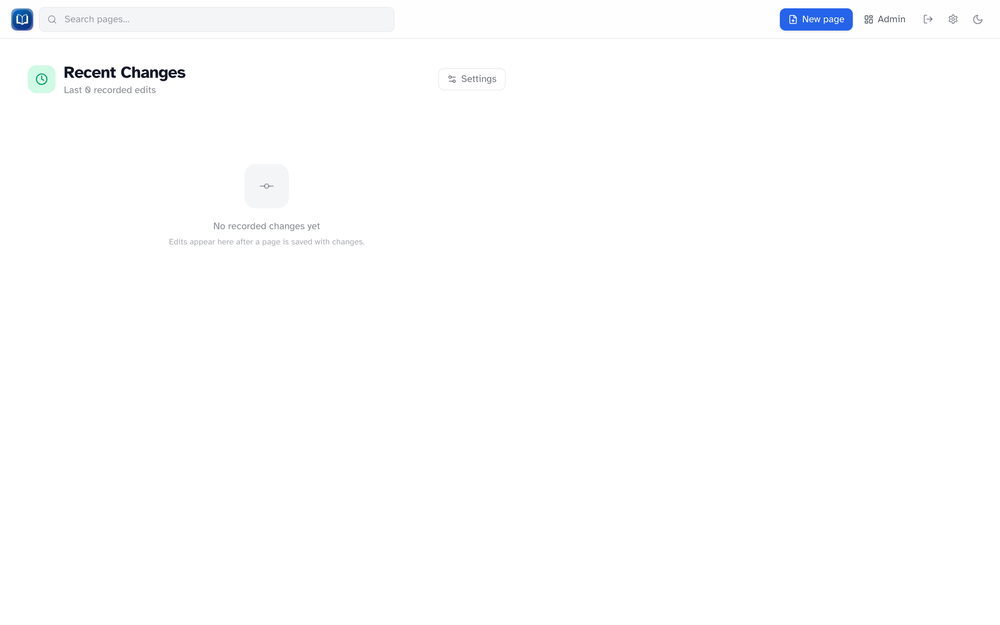

# Revision history

_Per-page history with edit summaries and expandable diffs._

Every time you save a page, Simple-Wiki stores a new revision. You can look back at older versions, see what changed, and restore an earlier state if you need to.

## Per-page history

On any article, click **History** next to **Edit** (you must be signed in to see those buttons).

The history page lists revisions newest-first. Each entry shows:

- When the edit happened
- The edit summary, if the editor wrote one
- An expandable diff against the next newer version (title changes included)

Restore is only available when you're signed in. Click **Restore this version**, confirm, and the wiki creates a **new** revision from that snapshot. Nothing in between is erased — you're just adding another version on top.

## Recent changes

_The `/recent` feed groups edits by day with expandable diffs._

The **Recent changes** page shows the last 100 edits across the whole wiki, grouped by day. Expand any entry to load its diff.

Open it at `/recent`, or go to **Admin → Recent Changes**.

## Revision retention

By default, every revision is kept forever. Admins can cap how many revisions are stored per page:

1. Go to **Admin → Recent Changes** (or `/recent` → **Settings**)
2. Set **Max revisions per page** — leave blank for unlimited
3. Save

When a limit is set, the oldest revisions are removed automatically. The live page content is not affected.

## Edit summaries

The **Edit summary** field in the editor is optional, but worth using on bigger edits. Summaries show up in both per-page history and recent changes, which makes it much easier to scan what happened.

## Tips

- Restoring never deletes history — it adds a new revision
- If you get a conflict while editing, someone else saved first. Check history to see their version, then edit again
