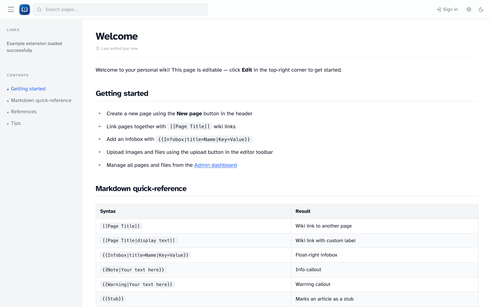

# Welcome

Simple-Wiki is a personal markdown wiki — wiki links, search, uploads, revision history, templates, and an admin dashboard. Most people run it on a home network or NAS.

_The home page with sidebar table of contents and a built-in syntax cheat sheet._

This guide covers **using** the wiki. For installation, Docker, and server settings, see the [project README](https://github.com/tpbnick/simple-wiki).

## What you can do

| Role        | Capabilities                                                                         |
| ----------- | ------------------------------------------------------------------------------------ |
| **Visitor** | Read, search, tweak reading settings (when public read is on)                        |
| **Editor**  | Create and edit pages, upload files, view history, restore revisions, use extensions |
| **Admin**   | All of the above, plus users, backups, extensions, and revision limits               |

!!! note "Every account can edit"
There are no read-only editors. Only create accounts for people you trust.

## Where to start

- New to the wiki? [First login](getting-started/first-login.md) then [Navigation](getting-started/navigation.md)
- Want to write? [Editing basics](editing/basics.md)
- Running the wiki? [Admin dashboard](admin/index.md)

## Built-in help

Your wiki also has a help article at `/wiki/help`. Open it from the gear icon → **Help**, or visit that URL directly.
