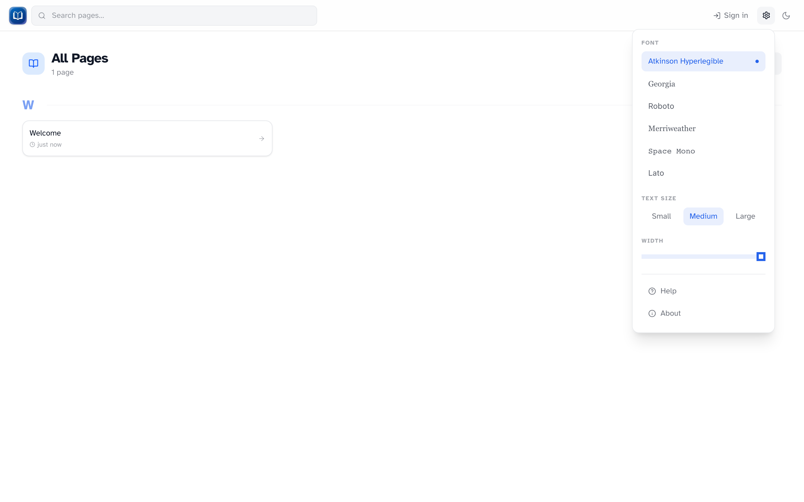

# Reading preferences

*Font, text size, column width, and links to Help and About.*

Click the **gear icon** in the header to adjust how articles look. Everything here is saved in your browser and applies across the whole wiki.

## Font

Six options: Atkinson Hyperlegible (default), Georgia, Roboto, Merriweather, Space Mono, and Lato.

## Text size

Small, Medium, or Large.

## Column width

On desktop, drag the slider to narrow or widen the text column. Handy on wide monitors where long lines are hard to read.

## Theme

The sun/moon toggle next to the gear switches light and dark mode. Saved in a cookie.

## Help and About

- **Help** — opens `/wiki/help`
- **About** — wiki version and build info

!!! tip "Per browser"
    These settings don't sync between devices or browsers. Set them up on each machine you read from.
