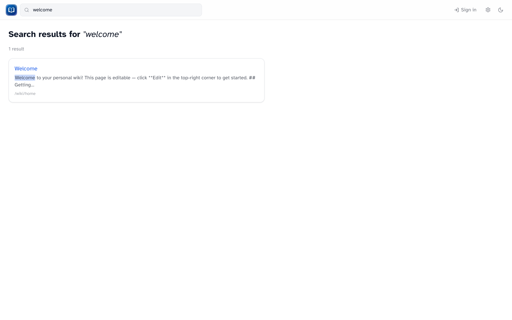

# Search

_Full-text search results with highlighted snippets._

## Header search

The search box in the header is the fastest way to find something:

1. Type at least **three characters**
2. Up to eight suggestions appear
3. Use ++Up++ / ++Down++ to move, ++Enter++ to open, ++Escape++ to close
4. **View all results** opens the full search page

## Full results

Press ++Enter++ in the header search, or go to `/search?q=your+query`.

You'll see matching pages with highlighted snippets. If you're signed in and nothing matches, you can **Create "[query]"** to start a new page with that title.

## What's searchable

Search covers articles and help pages, like the built-in `/wiki/help`. Just type the words you'd expect to find on the page.
